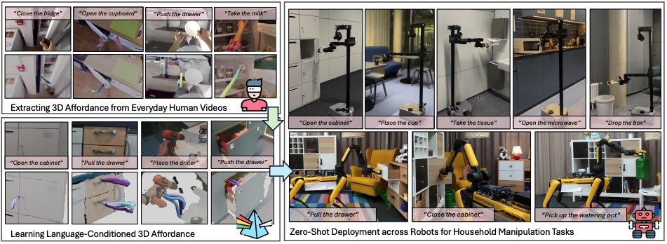

<h2 align="center">
  <b>VidBot: Learning Generalizable 3D Actions from In-the-Wild 2D Human Videos for Zero-Shot Robotic Manipulation</b>
  <br>
  <b><i>CVPR 2025</i></b>

<div align="center">
    <a href="https://arxiv.org/abs/2503.07135" target="_blank">
    </a>
    <a href="https://hanzhic.github.io/vidbot-project/" target="_blank">
    </a>
    <a href="https://www.youtube.com/watch?v=lfI6M1perfQ" target="_blank">
    </a>
</div>
</h2>

<div align="center">
    
</div>

This is the official repository of [**VidBot: Learning Generalizable 3D Actions from In-the-Wild 2D Human Videos for Zero-Shot Robotic Manipulation**](https://arxiv.org/abs/2503.07135). For more details, please check our [**project website**](https://hanzhic.github.io/vidbot-project/).


## Installation

To install VidBot, follow these steps:

1. **Clone the Repository**:
   ```bash
   git clone https://github.com/HanzhiC/vidbot.git
   cd vidbot
   ```

2. **Install Dependencies**:
   ```bash
   # Prepare the environment
   conda create -n vidbot python=3.10.9
   conda activate vidbot

   # Ensure PyTorch 1.13.1 is installed, pytorch-lightning might change the PyTorch version
   pip install pytorch-lightning==1.8.6
   pip install -r requirements.txt  

   # Install PyTorch Scatter
   wget https://data.pyg.org/whl/torch-1.13.0%2Bcu117/torch_scatter-2.1.1%2Bpt113cu117-cp310-cp310-linux_x86_64.whl 
   pip install torch_scatter-2.1.1+pt113cu117-cp310-cp310-linux_x86_64.whl
   rm -rf torch_scatter-2.1.1+pt113cu117-cp310-cp310-linux_x86_64.whl
   ```

3. **Download Pretrained Weights and Demo Dataset**:
   ```bash
   sh scripts/download_ckpt_testdata.sh 
   ```
   You can now try out VidBot with the demo data we've provided!

4. **(Optional) Install Third-Party Modules**:
   ```bash
   sh scripts/prepare_third_party_modules.sh
   ```
   Follow the installation instructions from [GroundingDINO](https://github.com/IDEA-Research/GroundingDINO), [EfficientSAM](https://github.com/yformer/EfficientSAM), [GraspNet](https://github.com/graspnet/graspness_unofficial), and [GraspNetAPI](https://github.com/graspnet/graspnetAPI) to set up these third-party modules.

   **Note**: The `transformers` library should be version 4.26.1. Installing `GroundingDINO` might change the version. Installing `MinkowskiEngine` for GraspNet can be painful. However, our framework can still function without GraspNet. In such cases, we will employ a simplified method to obtain the grasp poses.

## Affordance Inference

1. **Quick Start with VidBot**: To quickly explore VidBot, you don't need to install any third-party modules. After downloading the weights and demo dataset, you can use our pre-saved bounding boxes to run the inference scripts with the following command:
    ```bash** 
    bash scripts/test_demo.sh 
    ```

2. **Testing VidBot with Your Own Data**: To test VidBot using your own data, just put your collected dataset under the `./datasets/` folder. Please ensure your data is organized to match the structure of our demo dataset:
    ```text
    YOUR_DATASET_NAME/
    ├── camera_intrinsic.json
    ├── color
    │   ├── 000000.png
    │   ├── 000001.png
    │   ├── 00000X.png
    ├── depth
    │   ├── 000000.png
    │   ├── 000001.png
    │   ├── 00000X.png
    ```
    The `camera_intrinsic.json` file should be structured as follows:
    ```json
    {
        "width": width,
        "height": height,
        "intrinsic_matrix": [
            fx,
            0,
            0,
            0,
            fy,
            0,
            cx,
            cy,
            1
        ]
    }
    ```
    **We recommend using an image resolution of 1280x720.**

3. **Run the Inference Script**: To run tests with your own data, execute the following command, ensuring you understand the meaning of each input argument:
   ```bash
    python demos/infer_affordance.py 
    --config ./config/test_config.yaml  
    --dataset YOUR_DATASET_NAME  
    --frame FRAME_ID  
    --instruction YOUR_INSTRUCTION  
    --object OBJECT_CLASS  
    --visualize  
    ```
    If you have installed GraspNet and wish to estimate the gripper pose, add the `--use_graspnet` option to the command.


## Citation

**If you find our work useful, please cite:** 

```bibtex
@article{chen2025vidbot,
    author    = {Chen, Hanzhi and Sun, Boyang and Zhang, Anran and Pollefeys, Marc and Leutenegger, Stefan},
    title     = {{VidBot}: Learning Generalizable 3D Actions from In-the-Wild 2D Human Videos for Zero-Shot Robotic Manipulation},
    booktitle = {Proceedings of the Computer Vision and Pattern Recognition Conference},
    year      = {2025},
}
```

## Acknowledgement
Our codebase is built upon [TRACE](https://github.com/nv-tlabs/trace). Partial code is borrowed from [ConvONet](https://github.com/autonomousvision/convolutional_occupancy_networks), [afford-motion](https://github.com/afford-motion/afford-motion) and [rq-vae-transformer
](https://github.com/kakaobrain/rq-vae-transformer). Thanks for their great contribution!

## License

This project is licensed under the MIT License. See [LICENSE](LICENSE) for more details.
